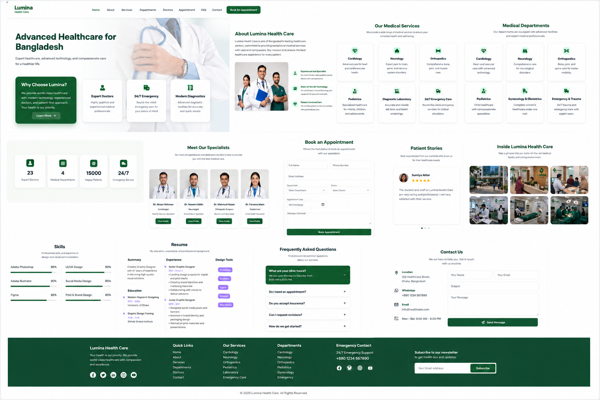

# 🏥 Lumina Health Care

### Modern Responsive Healthcare & Medical Website

<p align="center">
  
</p>

<p align="center">
A modern, responsive healthcare website built with HTML5, CSS3, JavaScript, Bootstrap 5, and PHP, designed to provide patients with an intuitive and professional online medical experience.
</p>

<p align="center">
  <a href="https://YOUR-LIVE-DEMO.com">🌐 Live Demo</a>
  &nbsp;•&nbsp;
  <a href="https://github.com/absshoyeb/LUMINA">📂 Source Code</a>
  &nbsp;•&nbsp;
  <a href="https://absshoyeb.com">👨‍💻 Portfolio</a>
</p>

---

# 📖 Overview

Lumina Health Care is a modern healthcare website designed for hospitals, clinics, and medical centers. The project focuses on providing patients with a clean, professional, and user-friendly experience while showcasing medical departments, healthcare services, specialist doctors, patient testimonials, appointments, and contact information.

Built as part of my frontend portfolio, the project demonstrates responsive web design, interactive UI components, and PHP-powered forms suitable for future backend integration.

---

# ✨ Features

- 🏥 Modern healthcare landing page
- 📱 Fully responsive design
- 👨‍⚕️ Doctor showcase
- 🏥 Medical departments
- 💚 Healthcare services
- 📅 Online appointment booking
- ⭐ Patient testimonials
- 🖼️ Hospital gallery
- ❓ Frequently Asked Questions
- 📍 Contact & location section
- 📨 Contact form
- 📊 Statistics section
- 🎨 Clean modern UI
- ✨ Smooth animations
- ⚡ Optimized user experience

---

# 🩺 Medical Services

Lumina showcases multiple healthcare services, including:

- Cardiology
- Neurology
- Orthopedics
- Pediatrics
- Diagnostic Laboratory
- 24/7 Emergency Care

---

# 🏥 Medical Departments

- Cardiology
- Neurology
- Orthopedics
- Pediatrics
- Gynecology & Obstetrics
- Emergency & Trauma

---

# 🛠️ Tech Stack

### Frontend

- HTML5
- CSS3
- JavaScript (ES6)

### Backend

- PHP

### Frameworks & Libraries

- Bootstrap 5
- Bootstrap Icons
- Swiper.js
- AOS
- GLightbox

### Design

- CSS Variables
- Flexbox
- CSS Grid
- Media Queries
- Google Fonts

---

# ⚙️ JavaScript Functionality

The project includes several interactive frontend features:

- Responsive navigation
- Sticky header
- Mobile navigation
- Scroll-to-top button
- Smooth scrolling
- Active navigation highlighting
- Hero animations
- Doctor slider
- Testimonial slider
- Gallery lightbox
- FAQ accordion
- Preloader
- Contact form validation
- Appointment form validation

---

# 🐘 PHP Functionality

The website includes PHP-powered forms using the **PHP Email Form** library.

### Appointment Booking

- Patient details
- Appointment date
- Medical department
- Doctor selection
- Message submission
- AJAX support

### Contact Form

- Name
- Email
- Subject
- Message
- AJAX submission

> **Note:** Before deployment, replace the default receiving email address with your own email or configure SMTP credentials.

---

# 📱 Responsive Design

Optimized for:

- 🖥️ Desktop
- 💻 Laptop
- 📱 Tablet
- 📲 Mobile
- 📳 Small Mobile Devices

Responsive improvements include:

- Responsive navigation
- Flexible hero section
- Adaptive typography
- Responsive doctor cards
- Responsive departments grid
- Responsive gallery
- Mobile appointment form
- Responsive contact section
- Optimized spacing

---

# 📂 Project Structure

```text
LUMINA/
│
├── assets/
│   ├── css/
│   ├── js/
│   ├── img/
│   └── vendor/
│
├── forms/
│   ├── appointment.php
│   ├── contact.php
│   └── newsletter.php
│
├── preview.png
├── index.html
└── README.md
```

---

# 🚀 Getting Started

### Clone the repository

```bash
git clone https://github.com/absshoyeb/LUMINA.git
```

### Navigate to the project

```bash
cd LUMINA
```

### Run the project

Open **index.html** in your browser.

For PHP functionality, run the project using a local server such as:

- XAMPP
- WAMP
- Laragon
- Local by Flywheel
- VS Code PHP Server

---

# 📌 Current Status

Lumina Health Care is a responsive healthcare website featuring modern frontend development and PHP-powered form handling.

The appointment and contact forms are integrated with the PHP Email Form library and are ready for deployment after configuring a valid receiving email address or SMTP credentials.

---

# 🚀 Future Enhancements

- Patient authentication
- Online patient portal
- Doctor dashboard
- Admin dashboard
- Appointment management
- Electronic medical records
- Online prescriptions
- Payment gateway
- Email notifications
- Live chat support
- Multi-language support
- Dark mode
- SEO optimization
- Accessibility improvements
- Progressive Web App (PWA)

---

# 👨‍💻 Author

**Abu Bakar Siddik Shoyeb**

Frontend Developer passionate about building modern, responsive, and user-friendly web experiences.

🌐 **Portfolio**  
https://absshoyeb.com

💼 **LinkedIn**  
https://www.linkedin.com/in/absshoyeb/

💼 **GitHub**  
https://github.com/absshoyeb

📧 **Email**  
info.absshoyeb@gmail.com

---

# ⭐ Support

If you enjoyed this project or found it useful, consider giving the repository a ⭐ on GitHub.

---

# 📄 License

This project was created for educational and portfolio purposes.

© 2026 Abu Bakar Siddik Shoyeb. All rights reserved.
